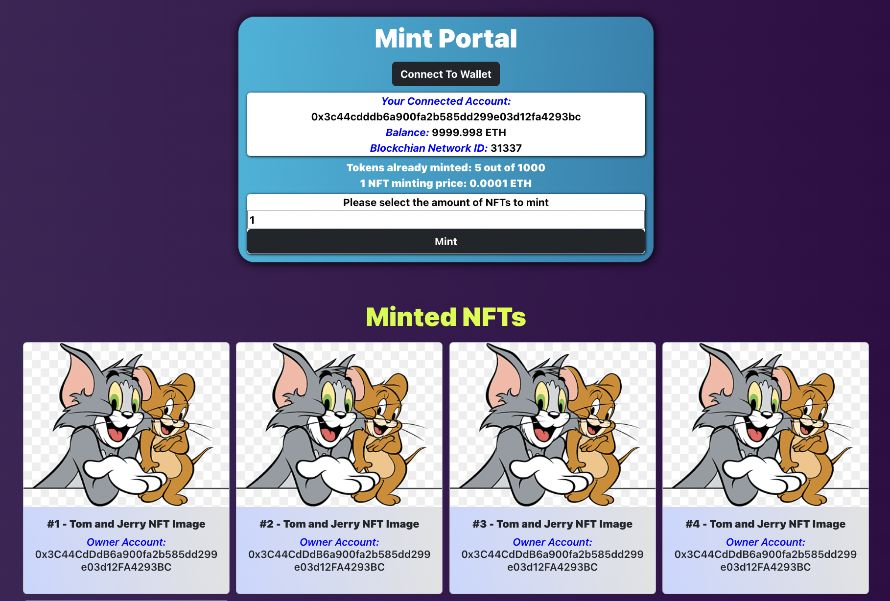

# NFT Minter

A dapp for minting NFTs.

## Smart Contracts

- NFTMinter (tom_and_jerry)

## Tools and Technologies Used

- nft:
  - IPFS, NFTs, Python
- contract:
  - Smart contracts (ERC721Enumerable, Ownable)
  - Hardhat, Solidity, OpenZeppelin, Remix IDE, Blockchain, JavaScript, Mocha Testcases, Solidity code coverage
- dapp:
  - React.js, Web3.js, Nginx, Metamask wallet
- Docker and Containers
- Ethernal dashboard - EVM compatible private blockchain network explorer.
- GitHub actions

## How To Run?

- [Upload NFTs to IPFS](./nft/.vscode/tasks.json)
- [Deploy smart contracts to the blockchain](./contract/.vscode/tasks.json)
- [Run the dapp](./dapp/.vscode/tasks.json)

## Workflow

1. name, symbol, owner, baseURI, maxSupply, totalSupply, cost
2. mint (for owner - no mint fee applied AND for user - mint fee applied)
3. totalSupply, balanceOf, walletOfOwner, tokenURI
4. safeTransferFrom (transferFrom), ownerOf, walletOfOwner
5. withdraw
6. transferOwnership, owner
